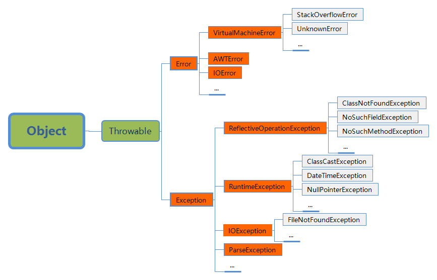

[TOC]

# Java基础

## 什么是OO,OOA,OOD,OOP？

> 参考：[https://www.jianshu.com/p/41b3d7e1c624](https://www.jianshu.com/p/41b3d7e1c624)

- OO :**Object - Oriented** ,面向对象,基于对象概念,以对象为中心,以类和继承为构造机制,来认识,理解,刻画客观世界和设计,构建相应的软件系统的一门方法;本意-- 模拟人类的思维方式,使开发,维护,修改更加容易。
- OOA:**Object - Oriented Analysis**, 面向对象分析,强调的是在系统调查资料的基础上,针对OO方法所需要的素材进行的归类分析和整理,而不是对管理业务现状和方法的分析---其实就是进一步对OO进行细化,初步得出OO的方法(或者简单的理解:在得出的文档中对接口粗略定义)。
- OOD:**Object - Oriented Design**,面向对象设计,OO方法中一个中间过渡环节,其主要作用是对OOA分析的结果进一步的规范和整理,以便能够被OOP直接接受---整理和定义OO的属性和方法。
- OOP:**Object - Oriented Programming**,把组件的实现和接口分开,并且让组件具有多态性---(抽象,封装,继承,多态)面向接口编程。

## 8种基本数据类型

| 序号 |    数据类型     | 位数 | 默认值 |    取值范围    |       举例        |
| :--: | :-------------: | :--: | :----: | :------------: | :---------------: |
|  1   |    byte(字节)     |  8   |   0    |  -2^7 - 2^7-1  |   byte b = 10;    |
|  2   |  short(短整数)  |  16  |   0    | -2^15 - 2^15-1 |   short s = 10;   |
|  3   |    int(整数)    |  32  |   0    | -2^31 - 2^31-1 |    int i = 10;    |
|  4   |  long(长整数)   |  64  |   0    | -2^63 - 2^63-1 |   long l = 10l;   |
|  5   |  float(单精度)  |  32  |  0.0   | -2^31 - 2^31-1 | float f = 10.0f;  |
|  6   | double(双精度)  |  64  |  0.0   | -2^63 - 2^63-1 | double d = 10.0d; |
|  7   |   char(字符)    |  16  |   空   |   0 - 2^16-1   |   char c = 'c';   |
|  8   | boolean(布尔值) |  8   | false  |  true、false   | boolean b = true; |

## 抽象和封装、继承、多态

> 封装、继承、多态称为Java面向对象的三大特性。

### 抽象和封装

- 类的抽象：将类的实现和类的使用分开。

- 类的封装：实现的细节被封装并且对用户隐藏。

类的创建者描述类的功能，让使用者明白如何才能使用类。从类外可以访问的方法和数据域的集合以及预期这些成员如何行为的描述。类的使用者不需要知道类是如何实现的。

### 继承

继承是使用已存在的类的定义作为基础建立新类的技术，新类的定义可以增加新的数据或新的功能，也可以用父类的功能，但不能选择性地继承父类。通过使用继承我们能够非常方便地复用以前的代码。

1. 子类拥有父类非 private 的属性（数据域）和方法。
2. 子类可以拥有自己属性和方法，即子类可以对父类进行扩展。
3. 子类可以用自己的方式实现父类的方法（重写）。
4. 子类不可以重写父类的构造方法。

### 多态 

> 多态意味着父类的变量可以指向子类对象。
>

#### 实现方式

在Java中有两种形式可以实现多态：继承（多个子类对同一方法的重写）和接口（实现接口并覆盖接口中同一方法）。

#### 动态绑定

一个方法可以在继承链的几个类中被实现。JVM决定在运行时调用哪个方法。

## 抽象类和接口

> 参考：[https://www.cnblogs.com/dolphin0520/p/3811437.html](https://www.cnblogs.com/dolphin0520/p/3811437.html)（评论很精彩，别错过）

### 抽象类

- 抽象方法必须为public或者protected（因为如果为private，则不能被子类继承，子类便无法实现该方法）。
- 抽象类不能用来创建对象；
- 如果一个类继承于一个抽象类，则子类必须实现父类的抽象方法。如果子类没有实现父类的抽象方法，则必须将子类也定义为为abstract类。

　　在其他方面，抽象类和普通的类并没有区别。

### 接口

- 接口中可以含有 变量和方法。
- 接口中的变量会被隐式地指定为public static final变量（并且只能是public static final变量，用private修饰会报编译错误）。
- 接口中的方法会被隐式地指定为public abstract方法且只能是public abstract方法（用其他关键字，比如private、protected、static、 final等修饰会报编译错误）。
- 接口中所有的方法不能有具体的实现，也就是说，接口中的方法必须都是抽象方法（Java8中接口有static和default方法可以有默认实现）。

## 异常

### 异常的分类



Throwable类是所有异常的根。所有的Java异常类都直接或者间接地继承自Throwable。可以通过继承Exception或者Exception的子类来创建自己的异常类。

- Error：系统内部错误，由Java虚拟机抛出。很少发生。
- Exception：由程序和外部环境所引起的错误，能被程序捕获和处理。
- RuntimeException：虽然他也是Exception的子类，但它一般是由于程序设计错误才会出现的异常，比如类型转换错误，访问一个越界数组或数值错误等。这在**程序运行时才会抛出发生**。
- Error和RuntimeException以及他们的子类都称为**免检异常**，所有其它的异常都称为**必检异常**。必检异常就是指编译器会强制程序员检查并通过try-catch块处理他们，或者在方法头进行声明（抛出）。

### 异常的处理

#### 声明异常

> 每个方法都必须声明它可能抛出的必检异常的类型，这称为声明异常。方法的调用者会被告知有异常，需要捕获或声明。

使用`throws`关键字进行异常的声明，例如：

```java
public void myMethod() throws IOException
```

如果要在一个方法上声明多个异常，用逗号（,）隔开即可。

*注意：*如果方法没有在父类中声明异常，那么就不能在子类中对其进行继承来声明异常。

#### 抛出异常

> 检测到错误的程序可以创建一个合适的异常类型的实例并抛出它，这就抛出一个异常。

使用`throw`关键字进行异常的抛出，例如：

```java
throw new IllegalAraumentException("这是异常信息");
```

#### 捕获异常

> 当抛出一个异常时，可以在try-catch块中捕获和处理它。

例如：

```java
try{
    //do something  and throw exception
}catch(Exception1 ex){
    //handler for exception1
}catch(Exception2 ex){
    //handler for exception2
}
```

如果try块中的某条语句抛出一个异常，Java就会跳过try块中剩余的语句，然后开始逐个查找处理这个异常的代码的过程（判断在catch块中的异常类实例是否是该异常对象的类型）。处理这个异常的代码称为异常处理器。

#### finally子句

> 无论异常是否产生，finally子句总是会被执行的。

不论异常是否出现或者是否被捕获，都希望执行某些代码。Java有一个finally子句，可以用来达到这个目的。语法如下：

```java
try{
    //do something  and throw exception
}catch(Exception1 ex){
    //handler for exception1
}catch(Exception2 ex){
    //handler for exception2
}finally{
    //always run
}
```

在任何情况下，finally块中的代码都会执行。

*注意：*使用finally子句时可以省略掉catch块。

#### 异常处理总结

- try 块：用于捕获异常。其后可接零个或多个catch块，如果没有catch块，则必须跟一个finally块。
- catch 块：用于处理try捕获到的异常。
- finally 块：无论是否捕获或处理异常，finally块里的语句都会被执行。当在try块或catch块中遇到return语句时，finally语句块将在方法返回之前被执行。

**在以下4种特殊情况下，finally块不会被执行：**

1. 在finally语句块中发生了异常。
2. 在前面的代码中用了System.exit()退出程序。
3. 程序所在的线程死亡。
4. 关闭CPU。

## 自动装箱与拆箱

### 装箱

> 将基本类型值转换为包装类对象的过程称为装箱（boxing）；

### 拆箱

> 装箱的相反转换过程，将包装类对象转换为基本数据类型的过程称为装箱（unboxing）；

Java允许基本类型和包装类类型之间进行**自动转换**。

## BigInteger和BigDecimal类

> BigInteger和BigDecimal类可以用于表示任意大小和精度的整数或者十进制数。他们位于`java.math`包中。

使用`new BigInteger();`和`new BigDecimal();`创建BigInteger和BigDecimal的实例。

使用`add`,`substract`,`multipe`,`divide`,`remainder`方法完成算术运算（加、减、乘、除、取余），例如下面是一个取余的例子：

```java
BigInteger num1 = new BigInteger("123123");
BigInteger num2 = new BigInteger("10");
BigInteger result = num1.remainder(num2);//123123 % 10
System.out.println(result);
```

## String 、StringBuffer和StringBuilder

### 可变性

String 类中使用 final 关键字字符数组保存字符串，`private　final　char　value[]`，所以 String 对象是**不可变**的。如下，源码中String类的定义：

```java
public final class String
	implements java.io.Serializable, Comparable<String>, CharSequence {
		/** The value is used for character storage. */
    	private final char value[];
    	...
    	...
    
}
```

StringBuilder 与 StringBuffer 都继承自 AbstractStringBuilder 类，在 AbstractStringBuilder 中也是使用字符数组保存字符串`char[]value` 但是没有用 final 关键字修饰，所以这两种对象都是**可变**的。

### 线程安全性

**String** 中的对象是不可变的，也就可以理解为常量，**线程安全**。AbstractStringBuilder 是 StringBuilder 与 StringBuffer 的公共父类，定义了一些字符串的基本操作，如 expandCapacity、append、insert、indexOf 等公共方法。**StringBuffer** 对方法加了同步锁或者对调用的方法加了同步锁（在源码中可以看到每个方法都加了`synchronized`关键字），所以是**线程安全**的。**StringBuilder** 并没有对方法进行加同步锁，所以是**非线程安全**的。 　　

### 性能

每次对 String 类型进行改变的时候，都会生成一个新的 String 对象，然后将指针指向新的 String 对象。

StringBuffer 每次都会对 StringBuffer 对象本身进行操作，而不是生成新的对象并改变对象引用。

相同情况下使用 StringBuilder 相比使用 StringBuffer 仅能获得 10%~15% 左右的性能提升，但却要冒多线程不安全的风险。

如果是多任务并发访问，使用StringBuffer；如果是单任务访问，使用StringBuilder会更有效。

## 方法重写和重载

### 方法重写

是指子类从父类中继承方法。使用场景一般是子类需要修改父类中定义的方法的实现。

- 仅当实例方法是可访问的，才能被覆盖。如果子类中定义的方法在父类中是私有的，那么这两个方法完全没有关系。
- 重写的方法必须使用相同的签名和相同的返回值类型在子类中定义。
- 静态方法也**能被继承但不能被覆盖**。

### 方法重载

重载方法使得你可以使用相同的名字来定义不同的方法，只要它们的签名是不同的。也就是说，一个类中有多个方法，具有相同的名字，但有不同的参数列表。Java编译器根据方法签名决定使用哪个方法。

### 重写和重载的区别

- 方法重写放生在通过继承而相关的不同类中；方法重载可以发生在同一个类中，也可以发生在由于继承而相关的不同类中。
- 方法重写具有相同的签名和返回值类型；方法重载具有相同的名字，但是不同的参数列表。

## 对象转换

> 对象的引用可以类型转换为对另一种对象的引用，这称为对象转换。

- 将对象`new Student()`赋值给一个`Object`类型的参数：

```java
Object o = new Student();
```

由于Student的实例也是Object的实例，所以语句`Object o = new Student();`合法。称为**隐式转换（implicit casting）**。像这样，将一个子类的实例转换成一个父类的变量，称为**向上转换（upcasting）**。

- 将`Object`类型的对象赋值给一个`Student`类型的参数：

```java
Student s = (Student)o;
```

为了告诉编译器o是一个Student对象，就要使用**显示转换（explicit casting）**。像这样，把一个父类的实例转换为它的子类变量，称为**向下转换（downcasting）**。

## equals方法与"=="运算符

**equals()** : 它的作用也是判断两个对象是否相等。但它一般有两种使用情况：

- 类没有覆盖 equals() 方法。则通过 equals() 比较该类的两个对象时，等价于通过“==”比较这两个对象。
- 类覆盖了 equals() 方法。一般，我们都覆盖 equals() 方法来两个对象的内容相等；若它们的内容相等，则返回 true (即，认为这两个对象相等)。

*注：*equals方法是被定义在Object类中的，但在Java API的许多类中被重写，比如我们常用的`java.lang.String`和`java.util.Date`，用于比较两个对象的内容是否相等。

**警告：**在之类中，应该使用`equals(Object obj)`签名来重写equals方法，而不是形如`equals(SomeClassName obj)`来重写。

**==** : 比较两个基本数据类型的值是否相等，或者判断两个对象是否具有相同的引用。

## 可见性修饰符

> 修饰符private、protected和public都称为可见性修饰符(visibility modifier)或可访问性修饰符(accessibility modifier)。用来指定是否可以从类外部访问数据域和方法。

### 类中成员的修饰符

| 类中成员的修饰符 | 在同一类可访问 | 在同一包内可访问 | 在子类内可访问 | 在不同包可访问 |
| :--------------: | :------------: | :--------------: | :------------: | :------------: |
|      public      |       √        |        √         |       √        |       √        |
|    protected     |       √        |        √         |       √        |       —        |
|    (default)     |       √        |        √         |       —        |       —        |
|     private      |       √        |        —         |       —        |       —        |

private：完全隐藏类的成员，不能从类外直接访问；

(default)：允许同一个包内的任何类直接访问类的成员，但是其它包中的类不可以访问；

protected：允许任何包中的子类或同一包中的类访问类的成员；

public：允许任意类访问类的成员。

### 类修饰符

修饰符private和protected只能用于类中的成员。public修饰符和(default)修饰符（也就是没有修饰符）既可以用于类的成员，也可以用于类。也就是说**一个类要么没有修饰符要么就是用public修饰**，但是**一个没有修饰符的类不能被其它包中的类访问**。

**注意**：子类可以重写它的父类中被protected修饰的方法，并把它的可见性改为public。但是**子类不能削弱父类中定义的方法的可访问性**，例如，如果一个方法在父类中定义为public，在子类中也必须定义为public。

