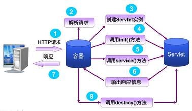

# JavaWeb基础笔记

## 三大组件之Servlet技术

> Java Servlet技术简称Servlet技术，是Java开发Web应用的底层技术。由Sun公式于1996年发布，用来代替CGI——当时生成Web动态内容的主流技术。

### Servlet技术与CGI技术的比较

> Servlet是一个特殊的Java程序，一个基于Java的Web应用通常包含一个或多个Servlet类。Servlet不能够自行创建并执行，必须运行在Servlet容器中。Servlet容器将用户的请求传递给Servlet程序，并将Servlet的响应回传给用户。通常一个Servlet会关联一个或多个JSP页面。CGI技术的主要问题是每个Web请求都需要新启动一个进程来处理，创建进程会消耗不少CPU周期，导致难以编写可扩展的CGI程序。而Servlet有着比CGI程序更好的性能，因为Servlet在创建后（处理第一个请求时）就一直保持在内容中。

#### CGI的缺点

- 需要为每个请求加载和运行一个CGI程序，这将带来很大的CPU开销
- 需要重复编写处理网络协议的代码以及编码，耗时费力。

#### Servlet的优点

- 只需要启动一个操作系统进程以及加载一个JVM，大大降低了系统的开销
- 如果多个请求需要做同样处理的时候，这时候只需要加载一个类，这也大大降低了开销
- 所有动态加载的类可以实现对网络协议以及请求解码的共享，大大降低了工作量。
- Servlet能直接和Web服务器交互，而普通的CGI程序不能。Servlet还能在各个程序之间共享数据，使数据库连接池之类的功能很容易实现。

### Servlet运行原理

#### Servlet的处理步骤



#### Servlet的生命周期

> Servlet生命周期定义了一个Servlet如何被加载、初始化，以及它怎样接收请求、响应请求，提供服务等。

##### Servlet接口

在这里我们自己随便建的一个Servlet,他默认继承自HttpServlet类，可以发现最终实现了接口Servlet。见下图：


其中Servlet接口中定义了如下五个方法，其中**init,service,destory是生命周期方法**：

```java
void init(ServletConfig var1) throws ServletException;

ServletConfig getServletConfig();

void service(ServletRequest var1, ServletResponse var2) throws ServletException, IOException;

String getServletInfo();

void destroy();
```

##### 生命周期方法

- init()方法，**只执行一次**：只有当该Servlet第一次被请求时，Servlet容器会调用一次这个方法。无论有多少客户机访问Servlet，都不会再重复执行这个方法。我们可以利用这个方法执行相应的初始化工作。

- service()方法，**客户端每次请求Servlet都会执行**：它是Servlet的核心，每当请求Servlet时，Servlet容器就会调用这个方法，而且每次请求都会传递给这个方法一个“请求”（ServletRequest）对象和一个“响应”（ServletResponse）对象作为参数。第一次请求Servlet时，Servlet容器调用init()方法和service()方法。后续的请求将只调用Service方法。

  通常service()方法会根据需要调用与请求对应的**doGet或doPost**等方法（是HttpServlet这个类处理的）。

- destroy()方法，**只执行一次**：当服务器关闭或项目被卸载时服务器会将Servlet实例销毁，此时会调用Servlet的destroy()方法。此时init()方法中的所有初始化工作将被销毁。

Servlet中有时会用到一些需要初始化与销毁的资源，因此可以把初始化资源的代码放入init方法中，销毁资源的代码放入destroy方法中，这样就不需要每次处理客户端的请求都要初始化与销毁资源。

##### 生命周期方法中的几个参数

- ServletRequest：对于每一个HTTP请求，Servlet容器都会创建一个ServletRequest实例，并将它传给Servlet的Service方法。ServletRequest封装了关于这个请求的信息。

- ServletResponse:：javax.servlet.ServletResponse接口表示一个Servlet响应。在**调用Servlet的Service方法前**，Servlet容器会首先创建一个ServletResponse，并将它作为第二个参数传给Service方法。ServletResponse隐藏了向浏览器发送响应的复杂过程。

  在ServletResponse中定义的方法之一是getWriter方法，它返回了一个可以向客户端发送文本的java.io.PrintWriter。默认情况下，PrintWriter对象使用**ISO-8859-1**编码。

- ServletConfig：Servlet的初始化方法(init方法)会传入一个ServletConfig。它里面封装的是初始参数（是key，value键值对），初始参数的设置可以通过web.xml和@WebServlet设置。该接口中包含了如下方法：

```java
    String getServletName();

    ServletContext getServletContext();

    String getInitParameter(String var1);

    Enumeration<String> getInitParameterNames();
```

通过在ServletConfig中调用**getServletContext**方法，可以获取ServletContext，它表示一个Servlet应用程序。每个Web应用程序只有一个上下文。如果将一个应用程序同时部署到多个容器的分布式环境中时，每台java虚拟机上的Web应用都会有一个ServletContext对象。有了ServletContext，就可以共享从应用程序中可以访问到的信息，并且可以动态注册Web对象。

可以通过**java.util.Enumeration<java.lang.String> getInitParameterNames()**获取所有的初始参数名称；

可以通过**java.lang.String getInitParameter(java.lang.String name)**获取到初始参数的值。

##### GenericServlet和HttpServlet类

- GenericServlet类

由于Servlet类是一个接口，如果通过实现Servlet接口来写Servlet的话，那我们就必须实现它的所有方法（5个），即便其中有一些根本就没有包含任何代码。所以我们那样做是没有意义的。还好有GenericServlet类的出现，它是一个抽象类，实现了Servlet和ServletConfig接口，并完成以下任务：

> - 将init方法中的ServletConfig赋给一个类级变量，以便可以通过调用getServletConfig获取。
> - 为Servlet接口中的所有方法提供默认的实现。
> - 提供方法，包含ServletConfig中的方法。

- HttpServlet类

HttpServlet类覆盖了GenericServlet类。使用HttpServlet时，还要借助分别代表Servlet请求和Servlet响应的HttpServletRequest和HttpServletResponse对象，HttpServletRequest和HttpServletResponse分别继承自ServletRequest和ServletResponse，并新增了一些方法（比如：Cookie相关，Session相关方法）。

在HttpServlet类中，原始的Service(覆写自GenericServlet)方法将Servlet容器request和response对象分别转换成HttpServletRequest和HttpServletResponse，并调用新的Service方法。

在新的Service方法中会检验用来发送请求的Http方法（通过调用request.getMethod），并调用相对应的方法（doGet、doPost、doHead、doPut、doTrace、doOptions和doDelete）,这七种方法中，每一种方法都表示一个Http方法，doGet和doPost是最常用的。

因此，我们继承自HttpServlet的Servlet就不用覆盖Service方法了，只需要覆盖我们需要的对应http方法即可。

### 会话管理（会话跟踪技术）

#### HttpSession对象

> 在所有的会话跟踪技术中，HttpSession对象是最强大和最通用的。一个用户可以有且最多有一个HttpSession,并且不会被其它用户访问到。

HttpSession对象在用户第一次访问网站的时候自动被创建。

可以通过调用```HttpServletRequest```的```getSession```方法获取该对象。

可以通过```HttpSession```的```setAttribute```方法将值放入HttpSession，同样也可以通过```getAttribute```方法取回之前放入的对象。**注意：如果放入HttpSession的值是对象类型，则该对象必须实现java.io.Serializable，否则Servlet容器视图序列化的时候会失败并报错，因为Servlet容器认为必要时会将存入的对象放入文件或数据库中，尤其在内存不够的时候。**

每个HttpSession有会话过期时间，可以调用```getMaxInactiveInterval```方法来查看会话多久过期。可以调用```setMaxInactiveInterval```方法来单独对某个HttpSession设定其超时时间，设置为0，则该HttpSession永不过期。通过调用```invalidate```方法强制会话过期并清空保存的对象。

#### Cookies

> Cookies是一个很少的信息片段，可自动地在浏览器和Web服务器间进行交互，因此cookies可存储在多个页面间传递的信息。Cookie作为HTTP header的一部分，其传输由HTTP协议控制。你可以控制cookies的有效时间。浏览器通常支持每个网站高达20个cookies。

向客户端发送Cookie

```java
Cookie c =new Cookie("name","value"); //创建Cookie 
c.setMaxAge(60*60*24); //设置最大时效，此处设置的最大时效为一天
response.addCookie(c); //把Cookie放入到HTTP响应中
```

从客户端读取Cookie

```java
Cookie[] cookies =request.getCookies(); 
if(cookies !=null){ 
   for(Cookie cookie : cookies){ 
       if("name".equals(cookie.getName())){
            //do  something
           cookie.getValue(); 
       } 
   }
 }
```

**优点:** 数据可以持久保存，不需要服务器资源，简单，基于文本的Key-Value

**缺点:** 大小受到限制；用户可以禁用Cookie功能；由于保存在本地，有一定的安全风险。

#### URL重写

> 在URL中添加用户会话的信息作为请求的参数，或者将唯一的会话ID添加到URL结尾以标识一个会话。适用于信息仅在少量页面间传递，且信息本身不敏感。

它将一个或多个token添加到URL的查询字符串中，每个token通常为key=value形式，如下：

```
http:localhost:8080?key1=value1&key2=value2
```

后台就需要通过判断value值以访问不同的页面(其实页面是同一个，只是数据不同)，例如：

```java
String value1 = request.getParmeter("key1");
if("value1".equals(value1)){
    //页面数据不同,页面数据1
}else{
	//页面数据不同,页面数据2
}
```

**优点**：在Cookie被禁用的时候依然可以使用。

**缺点**：url有长度限制；某些字符，如空格、问好等需要base64编码；所有页面必须动态生成，不能用预先记录下来的URL进行访问；不适用于跨越多个页面。

#### 隐藏域

> 使用隐藏域来保持状态类似于URL重写技术，但不是将值直接附加到URL上，而是放到HTML表单的隐藏域中。当表单提交时，隐藏域的值也同时提交到服务器端。

```html
<form method="post" action="...">
    <input type='hidden' name='id' value='1'/>
    //other elements

</form>
```

**优点：** Cookie被禁时可以使用

**缺点：** 使用场景有限制，所有页面必须是表单提交之后的结果；不适用于跨越多个页面。

#### Cookies和Session的区别

> 参考自知乎，链接：[https://www.zhihu.com/question/19786827/answer/28752144](https://www.zhihu.com/question/19786827/answer/28752144)

- 由于HTTP协议是无状态的协议，所以服务端需要记录用户的状态时，就需要用某种机制来识具体的用户，这个机制就是Session.典型的场景比如购物车，当你点击下单按钮时，由于HTTP协议无状态，所以并不知道是哪个用户操作的，所以服务端要为特定的用户创建了特定的Session，用用于标识这个用户，并且跟踪用户，这样才知道购物车里面有几本书。这个**Session是保存在服务端的，有一个唯一标识**。在服务端保存Session的方法很多，内存、数据库、文件都有。集群的时候也要考虑Session的转移，在大型的网站，一般会有专门的Session服务器集群，用来保存用户会话，这个时候 Session 信息都是放在内存的，使用一些缓存服务比如Memcached之类的来放 Session。
- 思考一下服务端如何识别特定的客户？这个时候Cookie就登场了。每次HTTP请求的时候，客户端都会发送相应的Cookie信息到服务端。实际上大多数的应用都是用 Cookie 来实现Session跟踪的，第一次创建Session的时候，服务端会在HTTP协议中告诉客户端，**需要在 Cookie 里面记录一个Session ID**，以后每次请求把这个会话ID发送到服务器，我就知道你是谁了。有人问，**如果客户端的浏览器禁用了 Cookie** 怎么办？一般这种情况下，会使用一种叫做**URL重写的技术来进行会话跟踪**，即每次HTTP交互，URL后面都会被附加上一个诸如 sid=xxxxx 这样的参数，服务端据此来识别用户。
- Cookie其实还可以用在一些方便用户的场景下，设想你某次登陆过一个网站，下次登录的时候不想再次输入账号了，怎么办？这个信息可以写到Cookie里面，访问网站的时候，网站页面的脚本可以读取这个信息，就自动帮你把用户名给填了，能够方便一下用户。这也是Cookie名称的由来，给用户的一点甜头。

总结一下：
Session是在服务端保存的一个数据结构，用来跟踪用户的状态，这个数据可以保存在集群、数据库、文件中；
Cookie是客户端（浏览器）保存用户信息的一种机制，用来记录用户的一些信息，也是实现Session的一种方式。

也就是说Session和Cookie一般配合使用，但是就目前来说**Session不是一定依赖Cookies，可以使用HTML5中的LocalStorage实现**。